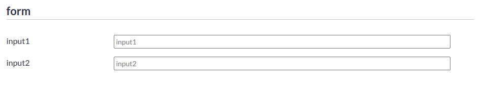
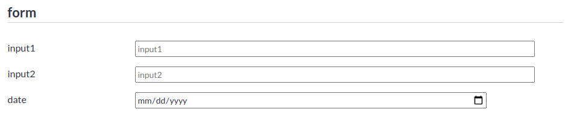
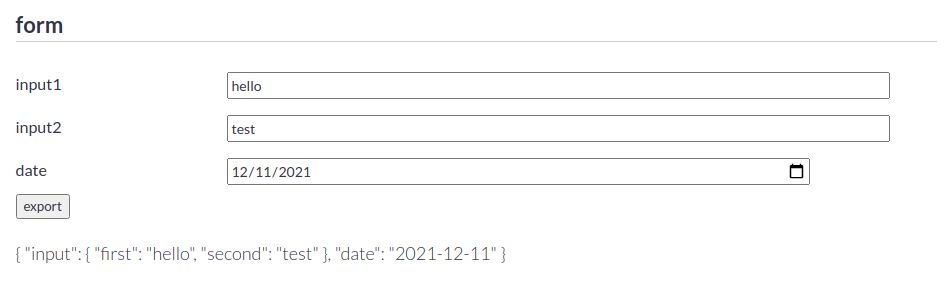

# Vue Variform

Vue.js component to create forms with various possibilities.

<b>A more detailed documentation including all functionalities of the library will follow soon.</b>

## Variform Features

- Form templates containing the input fields are defined using a JSON object. This is convenient for storing different form templates in a database and for rendering forms dynamically.
- It is possible to define a data mapping schema to capture only relevant information of the user input and not the entire JSON object defining the form.
- Captured data from a form can be used to populate the same or a different form at a later point in time. This feature makes it easy for users to edit the initial data afterwards.
- Individual validation functions can be registered for every input field of the form. Unsuccessful validation triggers an error message.
- Input elements and groups can be configured to be dynamically extendable by users to enable the input of lists of the same type of input.
- The library offers the possibility to create custom input fields and groups of input fields for completely individual forms. 
- In terms of design, the variform library uses [simple-grid](https://simplegrid.io/) for positioning the form elements and a very short and simple style.css file that can be easily adapted to fit the design of every application. 

## Getting Started

First, create a Vue project, for instance with vue-cli. If you have an existing project, skip this step.
```
vue create example-project
cd example-project
```

Then, install the variform component.
```
npm install --save vue-variform
```

To use the variform component, simply add two imports to the `main.js` file. 
```js{3-4}
import Vue from 'vue'
import App from './App.vue'
import 'vue-variform'
import 'vue-variform/dist/variform.css'

Vue.config.productionTip = false

new Vue({
  render: h => h(App),
}).$mount('#app')
```
This registers the `variform` component in the `Vue` instance and makes it usable in every component of the project.

After that, a simple form template can be defined in a seperate `form.js` file. For instance:
```js
export default {
    type: 'group',
    content: {
        headlineSize: 'h3',
        label: 'form',
        items: [
            {
                type: 'input',
                content: {
                    label: 'input1',
                    value: '',
                },
            },
            {
                type: 'input',
                content: {
                    label: 'input2',
                    value: '',
                },
            },
        ],
    },
}
```
In the `App.vue` component, the form can be rendered as follows:
```vue
<template>
  <div id="app">
    <variform :form-element-data="form"></variform>
  </div>
</template>

<script>
import form from './form'

export default {
  name: 'App',
  data: () => ({
    form
  }),
}
</script>
```

## Existing Form Elements
There are different types of input fields available in the library such as text inputs, radio buttons, checkboxes, dropdowns, groups and conditional form elements that reveal further content based on specific inputs. The [FormElementData](https://lwalisch.github.io/reference/interfaces/FormElementData.html) interface is always the starting point for every input field. Refer to the [datatypes reference](https://lwalisch.github.io/reference/) to find out how to add these input fields to the form template.

## Create Custom Form elements
If the library does not contain the required form elements, it is easily possible to add custom elements for your individual needs. Continuing the example from [Getting Started](#getting-started), a custom form element is added for date input using the HTML5 standard date input field. We create a new Vue component called `CustomDate.vue` with the following content.

```vue{3,22}
<template>
    <div>
        <template v-if="formElementData.type === 'customDate'">
            <div class="col-3">
                {{formElementData.content.label}}
            </div>
            <div class="col-8">
                <input 
                    type="date" 
                    v-model="formElementData.content.value" 
                    class="variform-input"
                />
            </div>
        </template>
    </div>
</template>

<script>

export default {
    name: 'CustomDate',
    props: ['formElementData'],
}
</script>
```
There are only a few rules to consider when creating a custom form element. First of all, the variform component passes a formElementData prop which contains all information to display in the form element. This prop must be defined in a custom form element as shown in line 21. Also make sure that the custom component is only rendered, if the matching type, in this case "customDate", is set in the form template (line 3). 

The new custom date form element is registered in the variform component of `App.vue`.
```vue{5,7-9,16,21}
<template>
  <div id="app">
    <variform
      :form-element-data="form"
      :slot-names="['customDate']"
    >
      <template v-slot:customDate="slotProps">
        <custom-date :form-element-data="slotProps.formElementData" />
      </template>
    </variform>
  </div>
</template>

<script>
import form from './form'
import CustomDate from './CustomDate.vue'

export default {
  name: 'App',
  components: {
    CustomDate,
  },
  data: () => ({
    form
  }),
}
</script>
```

Let's add an instance of the custom date form element to the form template of `form.js`.

```js{21-27}
export default {
    type: 'group',
    content: {
        headlineSize: 'h3',
        label: 'form',
        items: [
            {
                type: 'input',
                content: {
                    label: 'input1',
                    value: '',
                },
            },
            {
                type: 'input',
                content: {
                    label: 'input2',
                    value: '',
                },
            },
            {
                type: 'customDate',
                content: {
                    label: 'date',
                    value: '',
                }
            },
        ],
    },
}
```

## Data Mapping

The [DataMapping](https://lwalisch.github.io/variform/reference/interfaces/DataMapping.html) property in a FormElementData object is used to specify which data from a FormElement is exported when submitting the form. The formKeypath property of DataMapping tells variform which data to export from the form element. The externalKeypath property defines the keyPath of the form element's data in the exported object. Let's add dataMapping to the `form.js` form template of our example.

```js{9,17,25}
export default {
    type: 'group',
    content: {
        headlineSize: 'h3',
        label: 'form',
        items: [
            {
                type: 'input',
                dataMapping: { formKeypath: 'content.value', externalKeypath: 'input.first'},
                content: {
                    label: 'input1',
                    value: '',
                },
            },
            {
                type: 'input',
                dataMapping: { formKeypath: 'content.value', externalKeypath: 'input.second'},
                content: {
                    label: 'input2',
                    value: '',
                },
            },
            {
                type: 'customDate',
                dataMapping: { formKeypath: 'content.value', externalKeypath: 'date'},
                content: {
                    label: 'date',
                    value: '',
                }
            },
        ],
    },
}
```
In `App.vue` we add a button to execute the function to capture all data that was specified in the DataMapping of the form template.
```vue{4,12-15,34-36}
<template>
  <div id="app">
    <variform
      ref="variform"
      :form-element-data="form"
      :slot-names="['customDate']"
    >
      <template v-slot:customDate="slotProps">
        <custom-date :form-element-data="slotProps.formElementData" />
      </template>
    </variform>
    <div class="container">
      <div class="row"><button @click="exportFormData">export</button></div>
      <div class="row"><p>{{outData}}</p></div>
    </div>
    
  </div>
</template>

<script>
import form from './form'
import CustomDate from './CustomDate.vue'

export default {
  name: 'App',
  components: {
    CustomDate,
  },
  data: () => ({
    form,
    outData: '',
  }),
  methods: {
    async exportFormData() {
      this.outData = await this.$refs.variform.generateData(this.form);
    },
  },
}
</script>
```


Notice that it is also possible to create nested objects with DataMapping as shown in the output of the exported data. The data of the two input fields are grouped together in a nested object under the key "input" (`{"input": {"first": "hello", "second": "test"}}`). The the generation of form data can be executed with the [generateData](./Variform.md##generatedata) method of the Variform component.

### Converters
Data mapping with the formKeypath property is limited when it comes to complex form elements with multiple values. Let's consider an address input line that consists of multiple seperate input fields. The only possibility is to have seperate data mappings for all fields. Converters provide more flexibility. Converter functions can be passed to the variform component and can be invoked using the convertToFormData property of [DataMapping](https://lwalisch.github.io/variform/reference/interfaces/DataMapping.html). The string in convertToFormData must match the name of one of the converter functions passed into the variform component. 

The [example](https://lwalisch.github.io/) uses converters for the extendable list of form elements at the bottom of the form. Refer to the [Example Source Code](https://github.com/lwalisch/vue-variform/tree/master/src) to see how this is implemented.

## Populate Form with extracted Form Data
It is possible to populate a given form with data that was previously extracted from a form using the [populateForm](./Variform.md##populateForm) method of the Variform component. This method can be seen as the inverse process of [generateData](./Variform.md##generatedata). 

## Validators
Validators are functions passed into the Variform component and for every form element, it is possible to specify in the form template, that a validator function is executed to validate the content of the form element. The [validation](https://lwalisch.github.io/variform/reference/interfaces/FormElementData.html#validation) field of formElementData is used to specify the name of the function that should be executed for the validation process. If the validation of a form element finds an error, the error message is printed below the form elmement.

The [example](https://lwalisch.github.io/) uses validation in the first text input field. Refer to the [Example Source Code](https://github.com/lwalisch/vue-variform/tree/master/src) to see how this is implemented.

## Extendable lists of Form Elements

The [example](https://lwalisch.github.io/) shows an extendable list of form elements at the bottom of the form. Refer to the [Example Source Code](https://github.com/lwalisch/vue-variform/tree/master/src) to see how this is implemented.

More following soon...